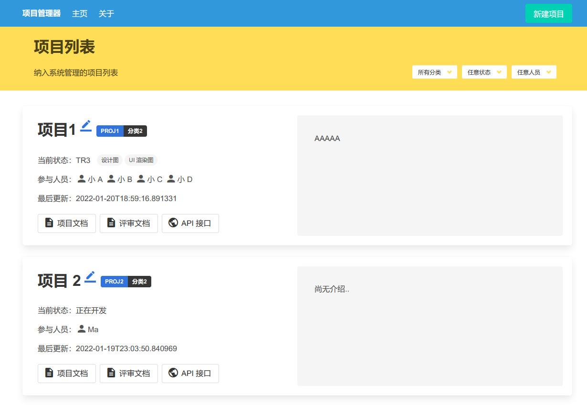
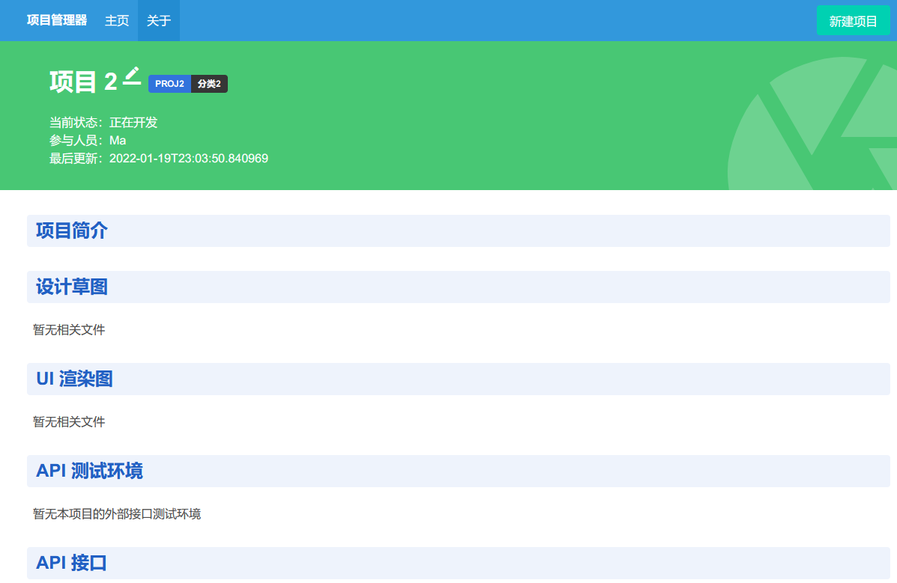
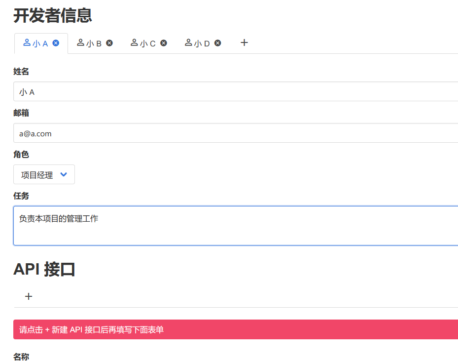

# Project Manager

项目（文档和评审）管理器，使用 clojure 和 clojurescript 搭建，[Leiningen][1] 构建，依赖 postgreSQL 数据库。

[1]: https://github.com/technomancy/leiningen

## Features

- 使用 ClojureScript 提供 “格式化项目数据” 的前端交互接口：功能丰富，实用与美观并重。
  - 使用 React 渲染 JS 组件
  - 使用 Message Bus 管理前端状态和副作用
  - 使用 Bulma CSS 库表达页面形式
  - 基于 History API 的路由
- 使用 Clojure 基于 “格式化项目数据” 生成丰富的展示：HTML 文档，DOCX 文档，PDF 文档等。
  - Swagger API 和 UI 支持
  - 数据库 Migration 支持
  - 基于 REPL 的热加载开发支持（Luminus，HugSQL）
  - 前后端共享路由和验证代码

## Running

    //touch dev-config.edn, write:
    {:dev true
     :port 3000
     :nrepl-port 7000
     :database-url "postgresql://xxx:5432/ice?user=&password=&stringtype=unspecified"}
     
    //run backend
    lein repl

    //run frontend
    lein shadow watch app

## Preview

Copyright © 2022 Marvin Studio